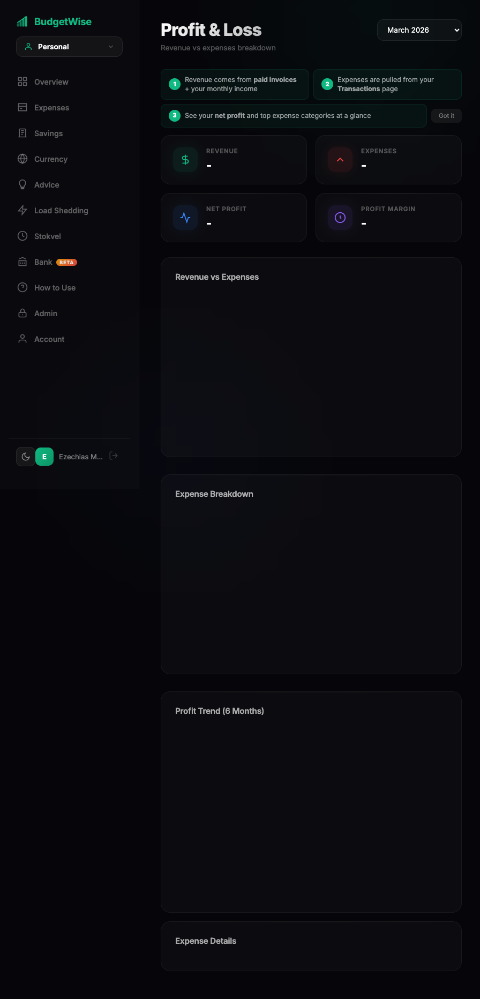

# BudgetWise

A Progressive Web App for personal and business budgeting. Track expenses, set savings goals, and visualize your spending with interactive charts.

**[Live Demo](https://budget-wise-ruby.vercel.app)**



## Features

- Personal, business, and family account modes
- Expense tracking with custom categories
- Savings goals with progress visualization
- Interactive charts (pie, bar, trend, currency)
- Multi-currency support with live exchange rates
- Tithe/giving tracker
- Dark/light theme
- Offline-ready PWA with service worker
- Audit logging for security
- Admin dashboard

## Tech Stack

- **Frontend:** Vanilla JavaScript (ES modules)
- **Backend:** Supabase (Auth, Database, Edge Functions)
- **Charts:** Chart.js
- **Banking:** Plaid / Stitch / Mono integration (Edge Functions)
- **Deployment:** Vercel

## Setup

1. Create a [Supabase](https://supabase.com) project
2. Run the SQL migrations in your Supabase dashboard
3. Update `js/supabase-config.js` with your project URL and anon key
4. Deploy to Vercel or serve locally:

```bash
npx serve .
```

## Author

**Ezechias Mulamba** — [GitHub](https://github.com/ezechias1)
